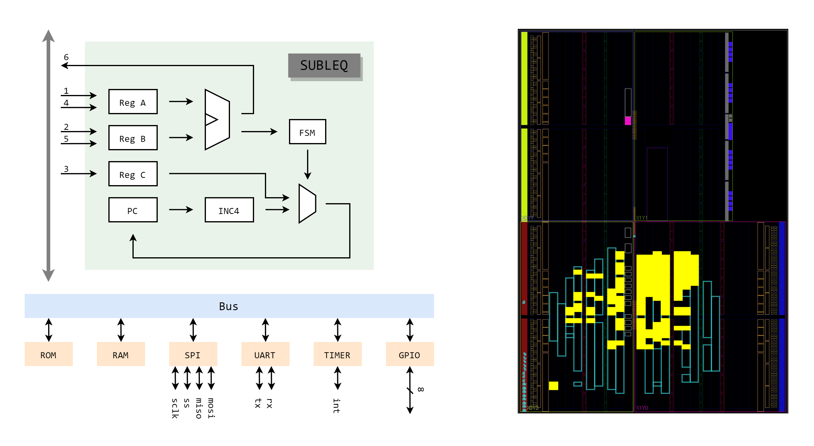
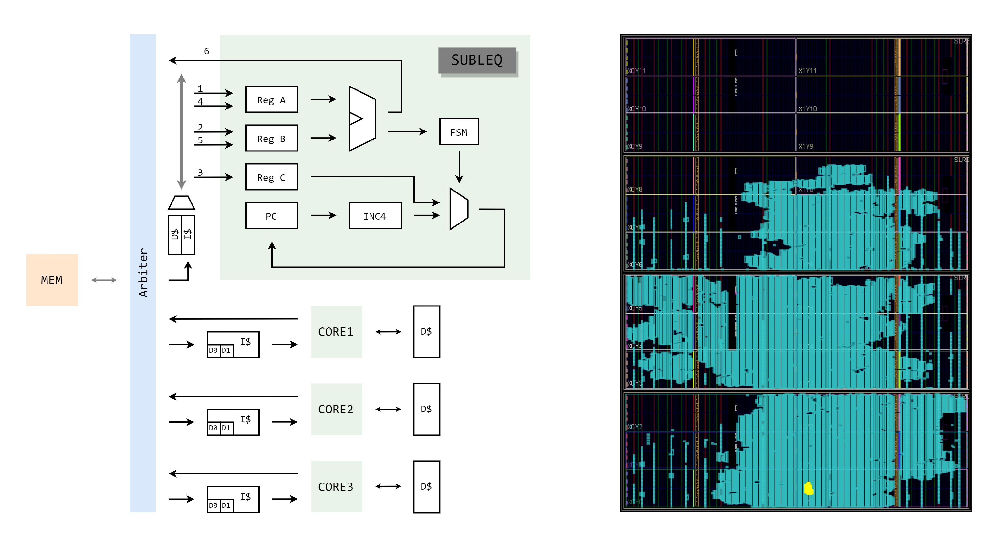
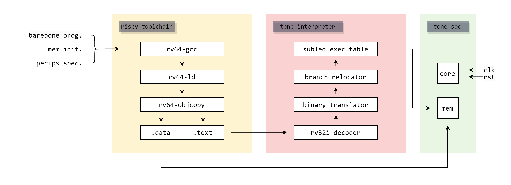
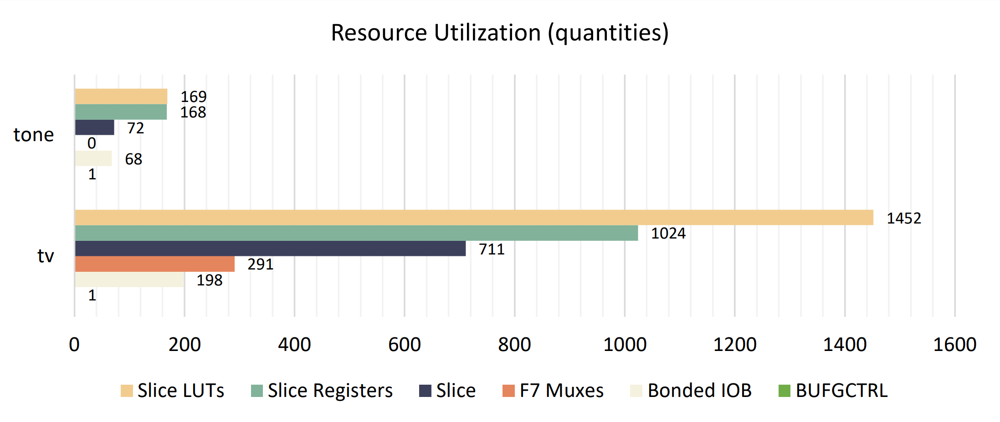
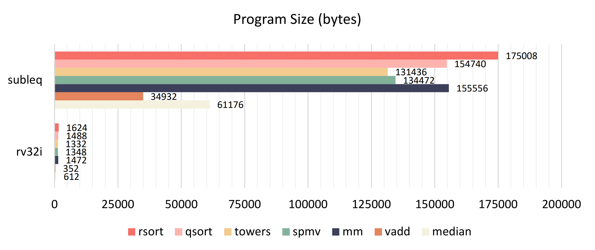

# TONE

This is a repository for a CPU based on the one instruction set computer (OISC).

## Introduction

The instruction set is a contract and a bridge connecting software and hardware, and its design plays a crucial role in determining the efficiency of computation execution within the system. The one instruction set computer (OISC) with a judicious choice for the single instruction and given infinite resources is capable of being a universal computer in the same manner as traditional computers that have multiple instructions.

We adopt `SUBLEQ` as only one instruction in this computing system, which can be proved to be Turing Complete. The instruction format is shown below. 

```
SUBLEQ A,B,C
```

The `SUBLEQ` instruction subtracts the contents at address B from the contents at address A, stores the result at address A, and then, if the result is not positive, transfers control to address C. Its pseudo code is shown below.

```
Instruction subleq a,b,c :
    Mem[a] = Mem[a] - Mem[b]
    if (Mem[a] ≤ 0)
        goto c
```

## Hardware Design

The CPU core's design to implement instruction function of `SUBLEQ` is quite clear at a glance, its work flow can be separated into three stages, that is,

1. Instruction Fetch: fetch 12 bytes from code segment in memory according to the program counter (3 cycles).
2. Operands Fetch: fetch two 4 bytes operands according to the operand address given by instruction (2 cycles).
3. Execute (subtract) and write back then branch: Subtract b from a and write the result to the address of a, then branch if the result less or equal to zero (1 cycle).

Moreover, we provide two soc design for different working environment: embedded system and manycore system. We also provide a demo to show the workflow [here](./demo/README.md).

### Soc for embedded system

This soc comprises a single CPU core, it accesses memory or peripherals through MMIO approach, the data transformation occurs on the bus with unified memory access ports. The soc diagram is shown left below.



We ran implementation on the FPGA part xc7a12tcsg325-2, the place&route diagram is shown right above (the highlighted area is the place&route result of the core), and the soc utilization table is shown below.

| Resource | Utilization | Available | Utilization % |
| -------- | ----------- | --------- | ------------- |
| LUT      | 2041        | 8000      | 25.51         |
| LUTRAM   | 1088        | 5000      | 21.76         |
| FF       | 745         | 16000     | 4.66          |
| IO       | 17          | 150       | 11.33         |
| BUFG     | 1           | 32        | 3.13          |


### Soc for manycore system

This soc comprises several CPU cores with accompanying data buffer, they access memory through an arbiter in a way of token ring passing. An instruction cache (I$) and a data cache (D$) can be set to improve performance, where the D$ will store some local variables only due to the low data locality (we will discuss it later). The soc diagram is shown below.



We ran implementation on the FPGA part xc7vx1140tflg1930-2, the place&route diagram is shown right above (the highlighted area is the place&route result for 1 of 1024 core), and the soc utilization table is shown below.

| Resource | Utilization | Available | Utilization % |
| -------- | ----------- | --------- | ------------- |
| LUT      | 217080      | 712000    | 30.49         |
| FF       | 171114      | 1424000   | 12.02         |
| BRAM     | 928         | 1880      | 49.36         |
| IO       | 67          | 1100      | 6.09          |
| BUFG     | 12          | 128       | 9.38          |

## Compiler Support

For the purpose of minimizing the work effort and maximizing the reuse of existing compile toolchains, we build an binary interpreter to translate RV32I executable files into our OISC program. The workflow is shown below. For more details, please refer to TONE interpreter's instruction [here](./interpreter/README.md).



## Discussion

Here we will discuss some of the top issues about this OISC system.

### 1. Saving in Hardware Resource

Obviously, OISC can build up a complete computing system using significantly fewer hardware resources since the extremely simple instruction decode unit and instruction execute unit. According to our experiments, the CPU core of TONE use 13.6% less resources in average than our RV32I-based single-cycle CPU implementation "tv", as shown below.



### 2. Bloating in Code Volume

However, the reduced instruction set cannot bring reduced user program, in other words, a simple calculation requires extremely lots of operations using single instruction. According to our experiments, the user program use 10298% larger memory space than RV32I-based user program, as shown below.



### 3. Performance Factors

Here we discuss the key factors that affect TONE's performance.

##### Data Bandwidth

According to the core design in TONE, all six machine cycles in an instruction cycle will access memory (read in five cycles and write in one cycle). When implementing on an FPGA board with 100MHz clock frequency, the data bandwidth will be more than 3GiB/s, which means there's no enough space for frequency improvement and will meet the bottleneck of memory bandwidth.

##### Data Locality

Although each instruction in TONE carries a branch judgment, according to our interpreter's code, the probability of branch taken is less than 2%, so an appropriately sized I$ can improve performance. Moreover, separate D$ can be set in manycore system to store frequently used data, such as CSR space, GPR space, temporary variable and constant value. These content in D$ share different address space according to the map strategy of its core, so that these private content will not write back to the shared memory. Whether to establish another separate D$ remains to be studied.

##### Instruction-level Parallelism

There are sequential five memory read and one memory write transactions refer to the multi-period computing structure in TONE. The computation is arranged in the last machine cycle, which means the data forwarding could be meaningless in this structure, thus making it hard to exploit pipeline execution.

Will the multi-issue technique work in this system? Maybe, but according to our implementation of interpreter, more than half instructions have data dependency with their previous instruction, the payoff of multi-issuing could be little.

##### Data-level Parallelism

Vector manipulation is not fit this system. Although it can support long data width without changing the instruction length, the CPU core can only support subtraction operations, then a large number of intermediate results will be written to and read from memory, resulting in a linear increase in memory bandwidth burden with the data width.

##### Thread-level Parallelism

The multi-core execution approach is more suitable for this system. As we discussed before, contents in private data cache of each core need not to write back to the shared memory, which will reduce some burden of accessing memory. It is worth noticing that adopting independent addressing approach will not consume any address space while adding a new core. Memory consistency and bus protocol in this system needs further development.

## Reference

[One-instruction set computer - Wikipedia](https://en.wikipedia.org/wiki/One-instruction_set_computer)
