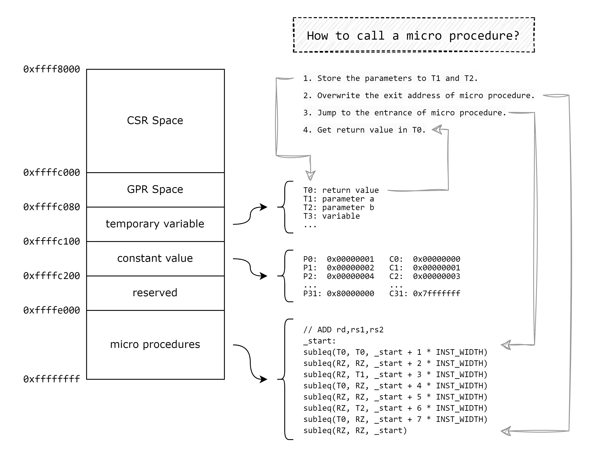

# TONE's Interpreter

This interpreter aims to provide a tool to run RISC-V programs on this OISC based system through **binary translation**.

## Introduction

This interpreter can translate part of RV32I bare-metal binary programs into executable files composed of `subleq` instruction sequence.

##### Instruction translation

Most of the instructions RV32I takes 2 operands from registers or immediate number, and store the value to a register or a memory cell. We promote code reuse by placing "system functions" in specified memory space, we call it "micro procedure".

Whenever a program wants to execute an instruction, it places the argument in a specific memory area, overwrites the exit address of the micro procedure, jumps to the entry of the micro procedure, then gets the result of the instruction execution (if any) from the corresponding memory area.

##### Address organization

We use the MMIO to allocate a memory space for RISCV execution registers, variables and constants.

##### How to call a micro procedure?

1. Store the parameters.
2. Overwrite the exit address of micro procedure.
3. Jump to the entrance of micro procedure.
4. Get return value.

The figure below shows how it works.

## TODO LIST

- Long address jump: lui, auipc, jal, jalr.
- Fine-grained memory access: byte and half.
- Privileged instructions.